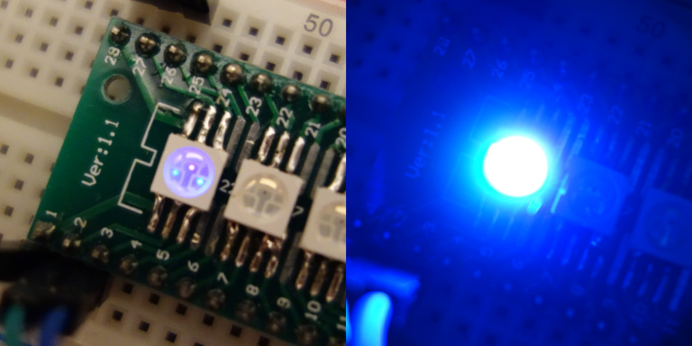

# 3-channel 16 bit software PWM LED driver



* 1800Hz, 16-bit PWM (12-bit + 4 bits dithering)
* 3-channels, almost evenly spaced phase offsets
* inverse polarity compared to WS2811 (pin high = LED on)
* UART based signalling, 38400 baud, 16 bit values, (2x 8bit uart frame, little endian/channel)
* end-of-frame is determined using a reset delay (between 1-2msec)
* no output line, led index is hard-coded in the firmware
* tested on PFS154 & PMS150C


# 3-channel 8 bit software PWM LED driver

* 912Hz, 8-bit PWM
* 3-channels, evenly spaced phase offsets
* inverse polarity compared to WS2811 (pin high = LED on)
* UART based signalling (19200 baud,)
* end-of-frame is determined using a reset delay (between 1-2msec)
* no output line, led index is hard-coded in the firmware
* tested on PFS154 & PMS150C


# Change address:

Even on one-time programmable chips, a limited number of address changes
if possible:

```
$ ./change_address.sh 4   # this is the fourth chip in the LED strip
```

OTP parts like PMS150C start out with a ROM with all ones, bits can only
be flipped once, from 1 to 0.

The following scheme makes it possible to update the chip's address many times:

The code reads (13 or 14 bit) opcodes at the end of the code section.
opcodes where the high bits are set to 0 are skipped. The
first opcode with non-zero high bits contains the address in its low byte.

